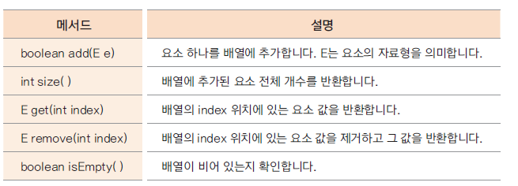

# 23. 객체 배열을 구현한 클래스 ArrayList

## java.util 패키지에서 제공되는 ArrayList

- 기존의 배열 선언과 사용 방식은 배열의 길이를 정하고 요소의 개수가 배열의 길이보다 커지면 배열을 재할당하고 복사해야 했음

- 배열의 요소를 추가하거나 삭제하면 다른 요소들의 이동에 대한 구현을 해야 함

- ArrayList는 객체 배열을 좀더 효율적으로 관리하기 위해 자바에서 제공해 주는 클래스

- 이미 많은 메서드들이 최적의 알고리즘으로 구현되어 있어 각 메서드의 사용 방법만 익히면 유용하게 사용할 수 있음

## ArrayList의 주요 메서드



## ArrayList를 활용한 간단한 예제

```
import java.util.ArrayList;
import ch21.Book;

public class ArrayListTest {

	public static void main(String[] args) {

		ArrayList<Book> library = new ArrayList<Book>();

		library.add(new Book("태백산맥1", "조정래"));
		library.add(new Book("태백산맥2", "조정래"));
		library.add(new Book("태백산맥3", "조정래"));
		library.add(new Book("태백산맥4", "조정래"));
		library.add(new Book("태백산맥5", "조정래"));

		for(int i =0; i<library.size(); i++) {
			library.get(i).showBookInfo();
		}
	}
}
```

## 다음 강의

[24. ArrayList를 활용한 간단한 성적 산출 프로그램](https://github.com/codemaker74/study/tree/master/backup/javacoursework/Chapter2/2-24/README.md)
